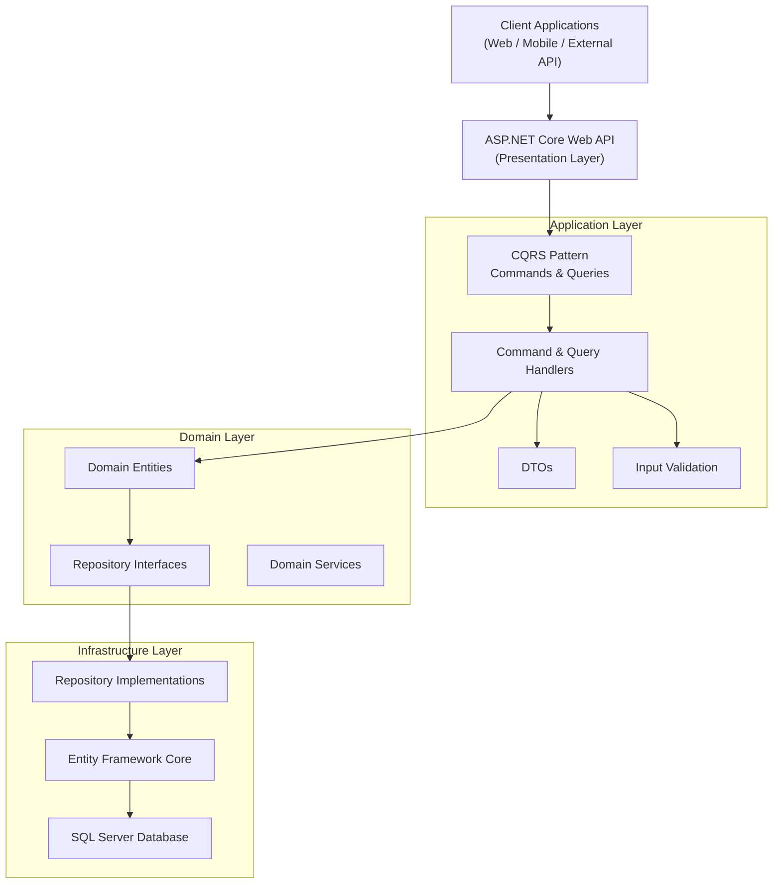
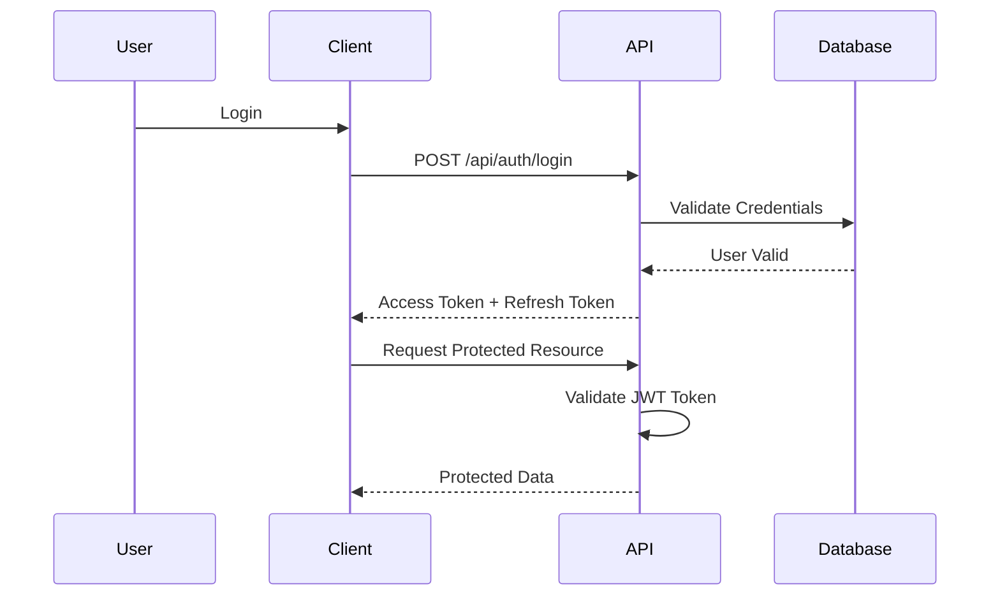
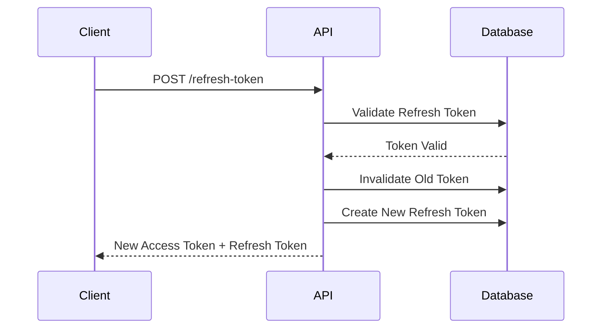
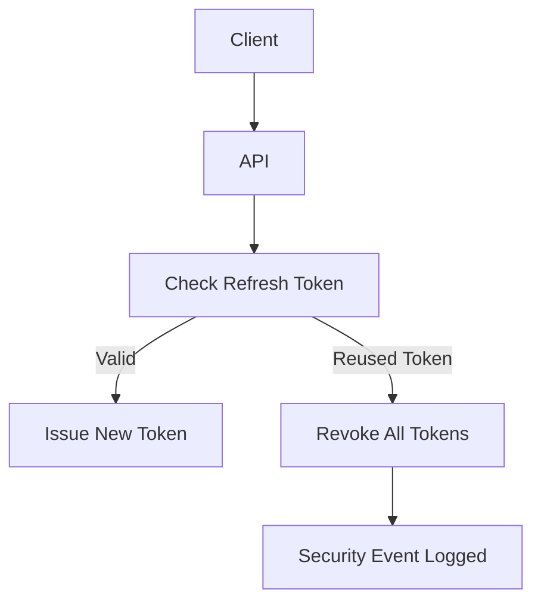

# Enterprise Order System API

A modern **Enterprise Order Management API** built with **ASP.NET Core**, implementing **Clean Architecture**, **CQRS**, and **JWT Authentication**.
The system demonstrates scalable backend design patterns commonly used in enterprise-grade systems.

This project showcases:

* Clean Architecture
* CQRS Pattern
* Secure Authentication with JWT
* Refresh Token Rotation
* Global Exception Handling
* Repository Pattern with Entity Framework Core

---

# Features

* User Authentication (Register / Login)
* JWT Authentication
* Refresh Token Rotation
* Refresh Token Reuse Detection
* Protected API Endpoints
* Global Exception Handling Middleware
* Clean Architecture
* CQRS Pattern
* Repository Pattern
* Entity Framework Core Integration

---

# Tech Stack

* ASP.NET Core Web API
* Entity Framework Core
* SQL Server
* JWT Authentication
* CQRS Pattern
* Clean Architecture
* Middleware
* REST API

---

# Architecture

This project follows **Clean Architecture principles** to separate concerns and improve maintainability.



This layered architecture ensures:

* Separation of concerns
* Scalability
* Testability
* Maintainability

---

# Authentication Flow

Authentication is implemented using **JWT Access Token and Refresh Token strategy**.



---

# Refresh Token Rotation

To enhance security, refresh tokens are rotated on every refresh request.



---

# Refresh Token Reuse Detection

If a refresh token is reused after rotation, the system will **invalidate the session**.



---

# Global Exception Handling

Centralized exception handling is implemented using **ASP.NET Core Middleware**.

Example response:

```json
{
  "status": 500,
  "message": "Unexpected server error occurred"
}
```

---

# API Endpoints

## Authentication

| Method | Endpoint                | Description          |
| ------ | ----------------------- | -------------------- |
| POST   | /api/auth/register      | Register new user    |
| POST   | /api/auth/login         | Login user           |
| POST   | /api/auth/refresh-token | Refresh access token |

---

## Protected Example Endpoint

| Method | Endpoint    | Description |
| ------ | ----------- | ----------- |
| GET    | /api/orders | Get orders  |

Requires:

```
Authorization: Bearer {access_token}
```

---

# Example API Flow

### Register

```
POST /api/auth/register
```

### Login

```
POST /api/auth/login
```

Response

```json
{
  "accessToken": "jwt_token",
  "refreshToken": "refresh_token"
}
```

### Refresh Token

```
POST /api/auth/refresh-token
```

Response

```json
{
  "accessToken": "new_access_token",
  "refreshToken": "new_refresh_token"
}
```

---

# Application Layers

## Application Layer

Responsible for:

* CQRS Commands & Queries
* Business Use Cases
* Validation
* DTO Mapping

---

## Domain Layer

Contains:

* Core Business Entities
* Domain Rules
* Interfaces

This layer has **no dependency on external frameworks**.

---

## Infrastructure Layer

Responsible for:

* Database Access
* Entity Framework Core
* Repository Implementations
* External Integrations

---

# Running the Project

### 1 Clone Repository

```
git clone https://github.com/yourusername/enterprise-order-system-api.git
```

---

### 2 Configure Database

Update connection string in:

```
appsettings.json
```

Example:

```
"ConnectionStrings": {
  "DefaultConnection": "Server=.;Database=EnterpriseOrderSystem;Trusted_Connection=True;"
}
```

---

### 3 Run Migration

```
dotnet ef database update
```

---

### 4 Run API

```
dotnet run
```

API will run at:

```
https://localhost:5001
```

---

# Security Highlights

Security practices implemented in this project:

* JWT Authentication
* Refresh Token Rotation
* Refresh Token Reuse Detection
* Secure Password Hashing
* Global Exception Handling
* Clean Architecture Separation

---

# Future Improvements

Possible enhancements for production systems:

* Role Based Authorization
* Order Management Module
* Payment Integration
* API Rate Limiting
* Distributed Caching (Redis)
* Logging with Serilog
* Docker Containerization

---

# Purpose

This project is built as a **learning and portfolio project** demonstrating how to design a secure and scalable backend API using **ASP.NET Core and Clean Architecture**.

---

# Author

Hendi Dwi Purwanto
ASP.NET Developer
